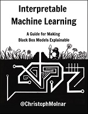
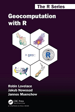

# R Books Online

Repository with links to **Free** R Books, available online.

## [Data Science with R](https://r4ds.had.co.nz)
By Garrett Grolemund & Hadley Wickham  

## [Text Mining with R](https://www.tidytextmining.com)
By Julia Silge and David Robinson  

## [Interpretable Machine Learning](https://christophm.github.io/interpretable-ml-book)  
By Christoph Molnar

## [Geocomputation with R](https://geocompr.robinlovelace.net)  
By Robin Lovelace, Jakub Nowosad and Jannes Muenchow

